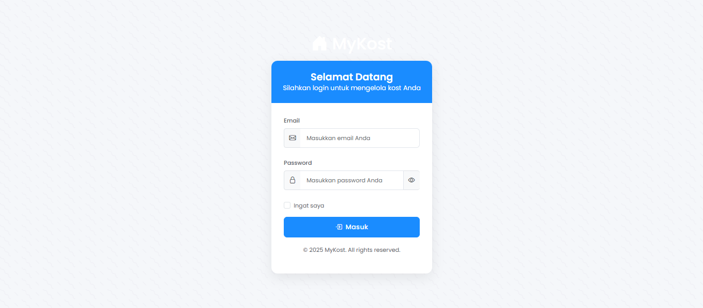
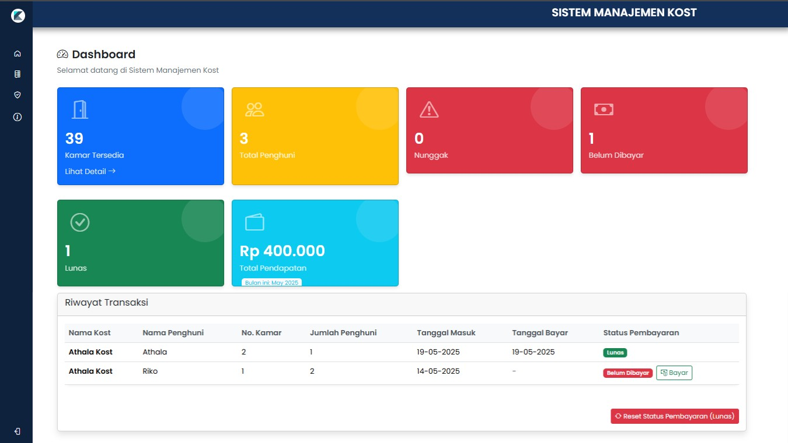
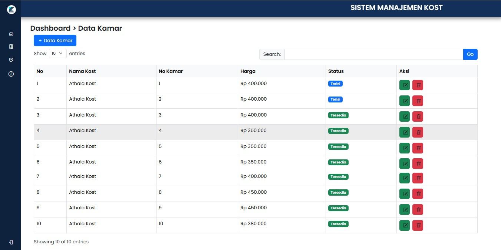
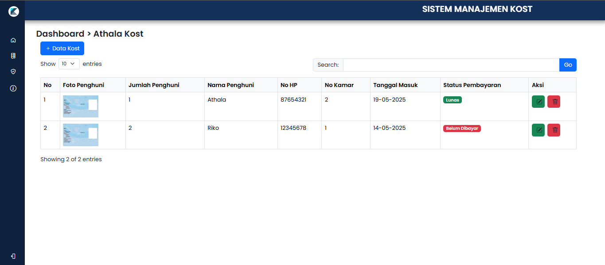

# 🏠 MyKost - Multi-Kost Management System

**MyKost** is a simple and efficient multi-property boarding house (kost) management system built using native **PHP**. It is designed to assist kost owners or administrators in handling daily operational tasks across up to **3 kost units**.

## ✨ Features

Here are the key features of **MyKost**, along with interface previews:

### 🔐 Login

*Login page to access the kost management system.*

---

### 📊 Dashboard

*Overview of Available Rooms, Total Tenants, Overdue Payments, Unpaid, Paid, and Total Income for the month of May 2025.*

---

### 🏘️ Kost Data

*Information about each kost unit including Kost Name, Room Number, Price, and Status.*

---

### 👥 Room & Tenant Data

*Details for each tenant: Photo, Number of Occupants, Name, Phone Number, Room Number, Check-in Date, and Payment Status.*

## 🛠️ Tech Stack

- 🔤 **PHP Native**
- 🗃️ MySQL / MariaDB
- 🎨 PHP, CSS, JavaScript (vanilla)
